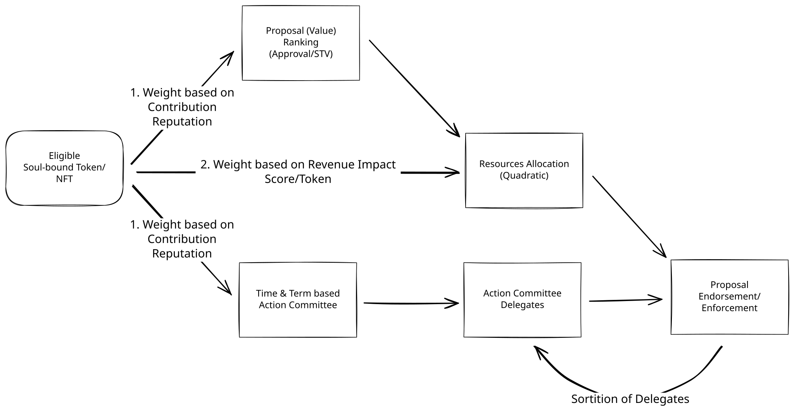

# EnDAOsment

EnDAOsment is a modular governance framework for DAOs that decide how to spend shared funds. I believe that a decision involves two components:

- **Equitable Collective/Communal Value**
- **Socioeconomically Sustainable Development**

Existing major DAO platforms lack a comprehensive multi-stage decision-making framework. To achieve this, I'd need to significantly customize my own smart contracts, so I might as well build a new platform from scratch. EnDAOsment's modular governance framework provides a robust and adaptable system for managing proposals within the DAO, allowing different voting mechanisms to be applied at each stage of a decision.

**Modular Governance**: The framework uses a modular design, so governance components can be swapped and customized without forking and rewriting entire contracts as needs change.

## Why batch decisions

Before starting this project, we reviewed major DAO platforms, including Aragon, DAOstack and Colony. Like most DAOs today, they vote on each proposal on its own. We think proposals should be batched into one voting period per fiscal cycle, because members have limited time, attention, information, money and manpower (bounded rationality). Each period works like electing a policy agenda: members first filter proposals by their social value, then use quadratic voting to allocate a fixed budget across the proposals that pass. Funded work is paid milestone by milestone, approved by randomly drawn committees of members with relevant contributions. For a fiscal period of, say, three months, there should be one major vote for everyone to review, discuss and decide.

## How a round works

1. **Submission.** Members submit proposals with a requested amount, a minimum viable amount, milestones and a category, plus a refundable deposit.
2. **Review.** Members read and discuss the slate; contribution scores (CRS) for the round are published and can be disputed.
3. **Stage 1 · value (WHY).** Each verified person casts one ballot, weighted from 1× to 4× by their contribution reputation along a capped S-curve. Members approve any subset of proposals; the most broadly supported become finalists.
4. **Stage 2 · allocation (HOW MUCH).** Members spread voice credits across finalists; votes are the square root of credits spent. Finalists are funded in score order until the round's budget runs out, never below a proposal's minimum viable amount.
5. **Settlement.** Anyone can compute the funded set; a short challenge window follows.
6. **Milestone payouts.** Each tranche is released only when a committee of members, drawn at random from those who opted in, accepts the deliverable.

Ballots are anonymous: by default through [MACI](https://maci.pse.dev), with Semaphore as an option. Every member is verified as a unique person with a zero-knowledge proof, so no one, including operators, can link a vote to a member.

## Key properties

- **No single key decides an outcome.** Every admin right ends at a timelock controlled by member votes; no role can cast or alter a ballot.
- **Founding powers expire.** An adopting organization starts under founding roles from its bylaws, which hand over to the timelock at 40 verified members. No funding round opens before then. The founder keeps only a rare veto over rule changes, which a supermajority can override, and a tie-breaking vote.
- **A constitution with checks and balances.** Core principles such as ballot privacy are beyond ordinary amendment; constitutional changes need broad supermajorities; a randomly drawn constitutional panel reviews passed proposals; and, once agencies exist, a members' chamber and an agencies' chamber must both agree on federal decisions.
- **An endowment that lasts.** Treasury spending is capped each year at a share of its value, so pledges from investing members carry most of each budget.
- **Pay for delivery, not promises.** Funds leave the treasury in milestone tranches; unmet milestones are clawed back.
- **Merit over capital.** Stage 1 gives each person one ballot, weighted at most 4× by contribution reputation (CRS); CRS also shapes Stage 2 credits and committee eligibility, dampened so a few members cannot dominate.
- **Lean by design.** Roles, categories and rules expire unless renewed; inactive members stop counting toward quorums; overhead is capped.

## Status

**This repository does not yet implement the design above.** The contracts currently in `contracts/` are an earlier prototype that votes on proposals one at a time and gives a single admin broad control. They are kept for reference only. Do not deploy them.

The redesign is specified in a design set covering the system design, mechanism rules, decision records, implementation plan, tickets and security review plan. *(Link to the shared design set here.)*

## Roadmap

| Release | Scope |
| --- | --- |
| 1 · MVP core | Batched rounds, approval and quadratic stages, milestone payouts, one committee per round, MACI ballots, zero-knowledge personhood, founder enrollment and handover, constitution and endowment spending rule, USDC treasury |
| 2 · Community and safety | Removal panels, disapproval veto, blind Stage 1, non-member proposals with endorsements, sponsorship and re-entry, per-category committees |
| 3 · Capital and allocation | Investor pledges and returns, ownership deals and follow-ons, multi-stablecoin treasury, optimal packing, STV and STAR ballots, reviewer calibration |
| 4 · Federation | Agencies with their own mandates, fast track, federation-wide upgrades, two-chamber federal decisions |

Each release ships after its own external audit and is switched on by a member vote.

## Adopting the framework

An organization adopting EnDAOsment supplies:

1. **Bylaws:** starting roles, their holders and terms, and the handover trigger.
2. **A CRS method:** how effort and results are scored per category, published with every snapshot.
3. **Legal setup:** a legal wrapper where needed, admitted jurisdictions, and how recipients are paid lawfully.
4. **Settings:** categories, round length, budgets and thresholds, within the framework's defaults and bounds.

The first adopter is a Wyoming DAO LLC.

## Repository layout

- `contracts/`, `script/`, `test/`: the earlier prototype (legacy, not for deployment)
- `docs/legacy/`: documentation of the earlier prototype (`ARCHITECTURE.md`, `DEPLOYMENT_AND_OPERATIONS.md`, `FEDERATED_AGENCY_GUIDE.md`)
- `EnDAOsmentProcessFlow.svg`: the original process flow

## License

GNU General Public License v3.0. See [LICENSE](LICENSE).
